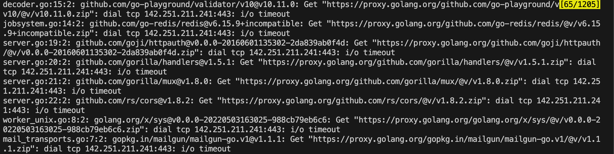

# This is a note for the local MSA setup

Reference: [https://github.com/sokrypton/ColabFold/blob/main/MsaServer/README.md](https://github.com/sokrypton/ColabFold/blob/main/MsaServer/README.md)

## Setting up the local ColabFold API server
---

**Ensure you have enough space (about 2000GB) to download the databases.**


- We download the ``setup_databases.sh`` from [https://github.com/sokrypton/ColabFold/blob/main/setup_databases.sh](https://github.com/sokrypton/ColabFold/blob/main/setup_databases.sh ).

- We download the ``MsaServer/config.json`` and ``MsaServer/setup-and-start-local.sh`` from [https://github.com/sokrypton/ColabFold/tree/main/MsaServer](https://github.com/sokrypton/ColabFold/tree/main/MsaServer).

- If you do not have the permission to execute the script, you can input the following command to give the permission:

```bash
chmod +x setup_databases.sh MsaServer/setup-and-start-local.sh
```

- Then run the command in ``MsaServer`` to set up local server:

```bash
bash ./setup-and-start-local.sh
```

- The databases will be downloaded to the ``databases`` folder. The file structure is as follows:

```
├─setup_databases.sh
└─MsaServer
   ├─setup-and-start-local.sh
   ├─mmseqs-server
   ├─databases
   └─mmseqs
```

- You can repeat to call ``setup-and-start-local.sh`` to start the server.Alternatively, you can simply execute the following command in ``MsaServer`` to turn on and off the server:
```bash
./msa-server -local -config config.json
```

## Tweaking ``config.json``
---

You can tweak the ``config.json`` file. The ``config.json`` should be in the ``MsaServer`` folder.

- ``paths`` field to specify the path of databases and server files. You need to change it to the corresponding path.
- ``server.address`` field to specify a custom port. By default, it is set to ``127.0.0.1:80``, which means you can access the server by using ``http://localhost``.
- ``paths.colabfold.parallelstages`` field to specify the parallel stage execution. This will 2-3x speedup the execution.
- ``local.workers`` field to specify how many job workers are allowed to run in parallel. We suggest **not setting it too large**, otherwise the server may experience parallel related errors.

Our default ``config.json`` is as follows:

```json
{
    "app": "colabfold",
    "verbose": true,
    "server" : {
        "address"    : "127.0.0.1:80",
        "dbmanagment": false,
        "cors"       : true
    },
    "paths" : {
        "databases"    : "${YOUR_OWN_PATH}/MsaServer/databases",
        "results"      : "${YOUR_OWN_PATH}/MsaServer/jobs",
        "temporary"    : "${YOUR_OWN_PATH}/MsaServer/tmp",
        "colabfold"    : {
            "parallelstages": true,
            "uniref"        : "${YOUR_OWN_PATH}/MsaServer/databases/uniref30_2302_db",
            "environmental" : "${YOUR_OWN_PATH}/MsaServer/databases/colabfold_envdb_202108_db",
            "pdb"           : "${YOUR_OWN_PATH}/MsaServer/databases/pdb100_230517",
            "pdb70"         : "${YOUR_OWN_PATH}/MsaServer/databases/pdb100",
            "pdbdivided"    : "${YOUR_OWN_PATH}/MsaServer/databases/pdb/divided",
            "pdbobsolete"   : "${YOUR_OWN_PATH}/MsaServer/databases/pdb/obsolete"
        },
        "mmseqs"       : "${YOUR_OWN_PATH}/MsaServer/mmseqs/bin/mmseqs"
    },
    "local" : {
        "workers"  : 16
    },
    "redis" : {
        "network"  : "tcp",
        "address"  : "mmseqs-web-redis:6379",
        "password" : "",
        "index"    : 0
    },
    "mail" : {
        "type"      : "null",
        "sender"    : "mail@example.org",
        "templates" : {
            "success" : {
                "subject" : "Done -- %s",
                "body"    : "Dear User,\nThe results of your submitted job are available now at https://search.mmseqs.com/queue/%s .\n"
            },
            "timeout" : {
                "subject" : "Timeout -- %s",
                "body"    : "Dear User,\nYour submitted job timed out. More details are available at https://search.mmseqs.com/queue/%s .\nPlease adjust the job and submit it again.\n"
            },
            "error"   : {
                "subject" : "Error -- %s",
                "body"    : "Dear User,\nYour submitted job failed. More details are available at https://search.mmseqs.com/queue/%s .\nPlease submit your job later again.\n"
            }
        }
    }
}


```

## Forcing databases to stay resident in system cache
---

You can use ``vmtouch`` to force database to stay in the system cache. This will greatly accelerate the response time of the server, taking only a few seconds. **Ensure you have enough memory (about 700GB) to cache the databases.**

- First, you need to install ``vmtouch`` by running the following command:
```bash
sudo apt-get install vmtouch
```
Alternatively, you can also use [https://github.com/hoytech/vmtouch](https://github.com/hoytech/vmtouch) for manual installation.

- After installing ``vmtouch`` , you can execute the following command to make sure that the search databases are not evicted from the system cache:
```bash
cd databases
sudo vmtouch -v -f -w -t -l -d -m 1000G *.idx 
```

## Conduct the MSA via the local databases instead of the remote server
---

Finally, you can run inference with local MSA generation using Boltz-1 with:
```bash
python ./scripts/predict.py --data input_path --use_msa_server --msa_server_url http://localhost
```


## Remark

If you encounter an error message containing the keywords "go" and "i/o timeout" as follows:


You can set the following environment variable to solve the problem:
```bash
export GOPROXY=https://goproxy.cn,direct
```


